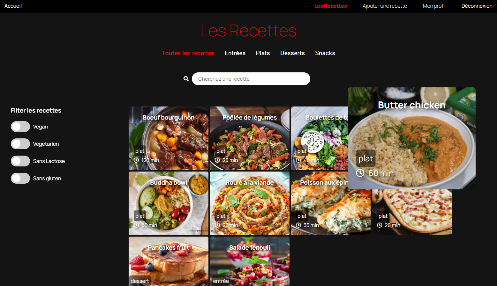
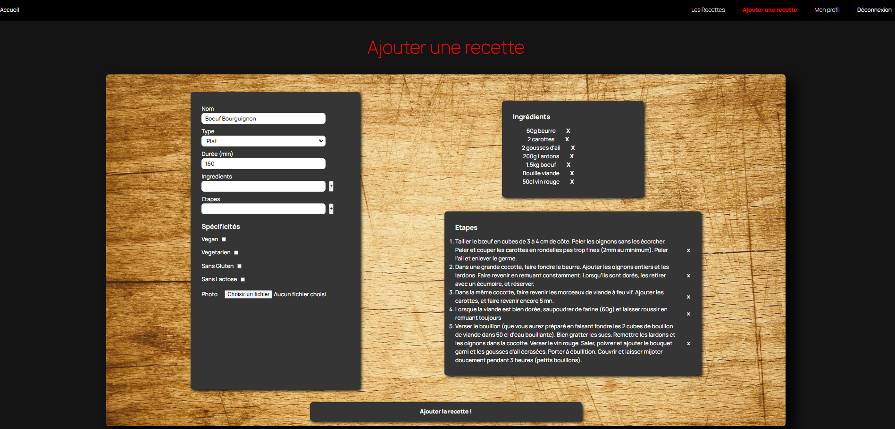

# App Recipe

> Create recipes, share them with other users and filter them by their specifities!

## Table of contents

- [General info](#general-info)
- [Screenshots](#screenshots)
- [Technologies](#technologies)
- [Setup](#setup)
- [Features](#features)
- [Status](#status)
- [Contact](#contact)

## General info

This app was created to train my Reactjs skills on the front side but also nodejs and express for the back end;
My biggest progress building the app were using react hooks, handling multiple filters on an Api call, use some frameworks, create a more complex form than I did previously;

## Screenshots

## Technologies

- React - version 16.13.1
- Axios - version 0.19.2
- Material-ui - version 4

## Setup

$npm i
create .env REACT_APP_BACKEND_URL = http://localhost:XXXX
$npm start

## Features

List of features ready and TODOs for future development

- Multiple filtering with sliders
- Create form with intermediate steps(for ingredients and recipe steps)
- Netflix inspired look

To-do list:

- Rating and comment system (stars?)
- Favorite recipes list per user

## Status

Project is: _in progress_

## Contact

Created by [@lepfau](https://www.github.com/lepfau) - feel free to contact me!
