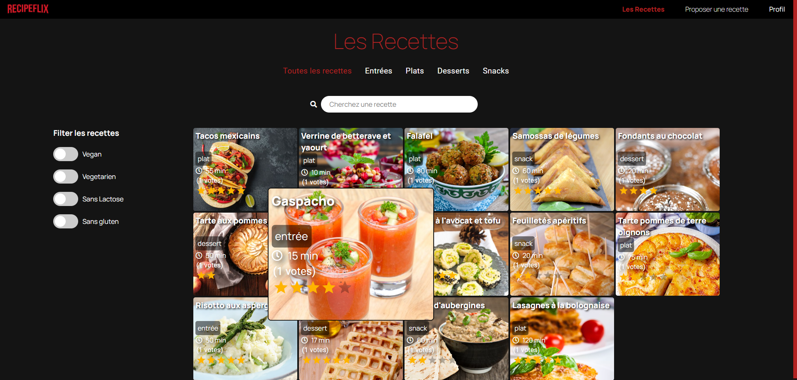
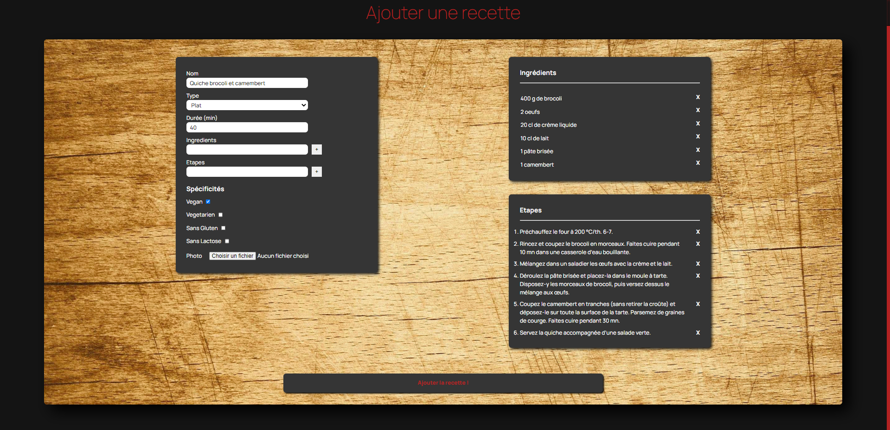

# App Recipe

> Create recipes to share, filter them, add your favorites, rate and comment them !
Project is deployed [here](https://recipe-flix.herokuapp.com) but still on progress.
Back end part can be found [here](https://github.com/lepfau/recipeflix-server)

## Table of contents

- [General info](#general-info)
- [Screenshots](#screenshots)
- [Technologies](#technologies)
- [Setup](#setup)
- [Features](#features)
- [Status](#status)
- [Contact](#contact)

## General info

This app was created to train my Reactjs skills on the front side but also nodejs and express for the back end;
My biggest progress building the app were using react hooks, handling multiple filters on an Api call, use some frameworks, create a more complex form than I did previously;

## Screenshots

## Technologies

- React - version 16.13.1
- Axios - version 0.19.2
- Material-ui - version 4

## Features

List of features ready and TODOs for future development

- Multiple filtering with sliders
- Create form with intermediate steps(for ingredients and recipe steps)
- Rating and comment system
- Favorite recipes list
- Netflix inspired look

## Status

Project is: _completed_

## Contact

Created by [@lepfau](https://www.github.com/lepfau) - feel free to contact me!
